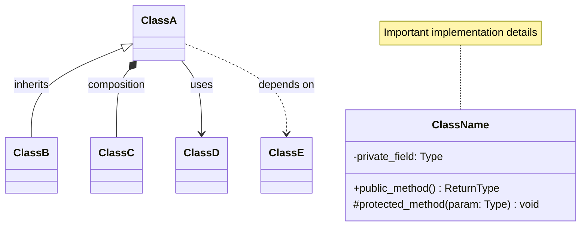
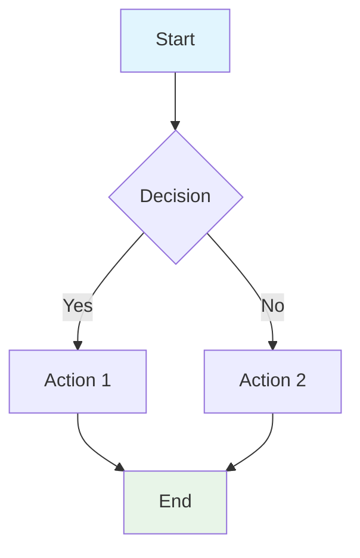
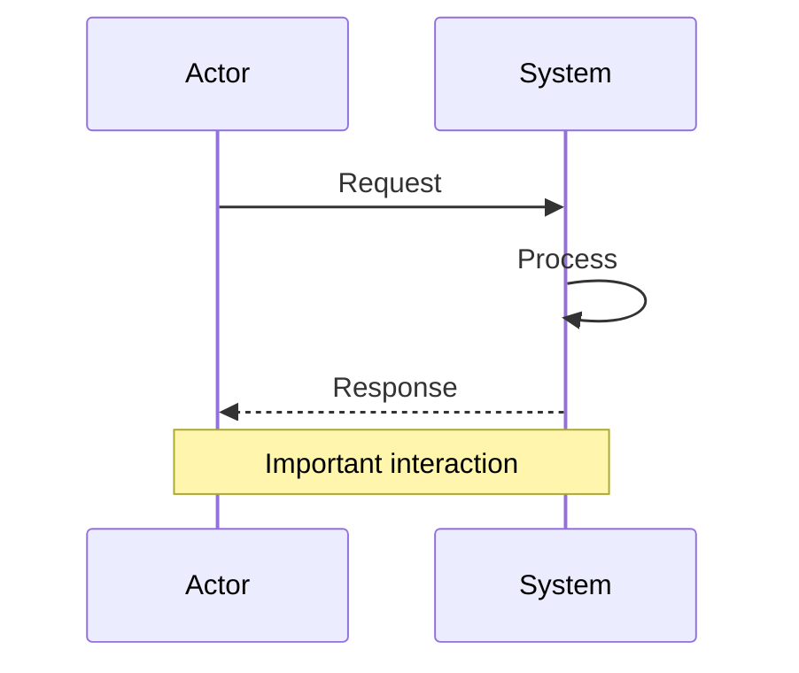

# Maintain Mermaid Diagrams

Instructions for generating, maintaining and updating the mermaid diagrams in the current project's architecture documentation.

## 📋 Overview

The architecture documentation should include comprehensive mermaid diagrams that illustrate:
- System context and component relationships  
- Module dependencies and data flows (150+ modules)
- Class hierarchies and interactions
- Service layer patterns and UI architecture

## 📂 Diagram Locations

All architecture diagrams are to be stored in `/docs/architecture/`:

```
docs/architecture/
├── README.md                           # Main architecture overview
├── context_diagram.md                  # System context & data flow  
├── module_overview.md                  # Module relationships (150+ modules)
└── class_diagrams/
    ├── core_classes.md                 # Database, DAOs, data processing
    ├── data_models.md                  # Domain models & database schema
    └── service_layer.md                # UI architecture & service coordination
```

## 🛠️ Update Process

### Step 1: Identify Affected Diagrams
Determine which diagrams need updates based on your changes:

| Change Type | Primary Diagram | Secondary Diagrams |
|-------------|----------------|-------------------|
| New analytics module | module_overview.md | context_diagram.md |
| Database schema change | data_models.md | core_classes.md |
| New UI component | service_layer.md | module_overview.md |
| New service/manager | service_layer.md | module_overview.md |
| Architecture refactor | context_diagram.md | All others |

### Step 2: Update Mermaid Code
Edit the relevant `.md` files to update mermaid diagram code:

```mermaid
# Example: Adding a new class to core_classes.md
class NewAnalyticsService {
    -CacheManager cache_manager
    -Logger logger
    +calculate_advanced_metrics() Dict
    +generate_insights() List[str]
}

# Add relationships
NewAnalyticsService --> CacheManager : uses
NewAnalyticsService --> DatabaseManager : queries
```

### Step 3: Validate Diagrams
Test diagram syntax and rendering:

1. **Online validation**: Copy mermaid code to [Mermaid Live Editor](https://mermaid.live/)
2. **Local preview**: Use VS Code Mermaid extensions
3. **Check syntax**: Ensure proper mermaid formatting

### Step 4: Update Cross-References
Update any cross-references in documentation:

- Update `docs/architecture/README.md` if adding new diagrams
- Update navigation links between diagram files
- Update main project README if architecture changes significantly

## 📝 Mermaid Syntax Guidelines

### Class Diagrams


### Flowcharts


### Sequence Diagrams


## 🎨 Styling Guidelines

### Color Scheme
Use consistent colors across all diagrams:

```mermaid
%% Standard color palette
style MainComponents fill:#4ecdc4,color:#fff
style DataLayer fill:#f3e5f5
style CacheLayer fill:#fff8e1  
style UILayer fill:#e8f5e8
style ExternalSystems fill:#e1f5fe
```

### Component Categories
- **🏗️ Core Infrastructure**: `#4ecdc4` (teal)
- **📊 Analytics/Data**: `#f3e5f5` (light purple)
- **⚡ Caching/Performance**: `#fff8e1` (light yellow)
- **🎨 UI Components**: `#e8f5e8` (light green)
- **🔗 External Systems**: `#e1f5fe` (light blue)

## 📋 Common Update Scenarios

### Adding a New Analytics Module
1. **Update module_overview.md**: Add to Analytics Engine section
2. **Update class diagrams**: Add detailed class structure if significant
3. **Update context_diagram.md**: Add if it's a major new capability

```mermaid
# Example: New trend analysis module
TREND_ANALYZER[trend_analyzer.py<br/>📈 Advanced Trends]
TREND_ANALYZER --> DAILY_CALC
TREND_ANALYZER --> CACHE
```

### New UI Component or Widget
1. **Update service_layer.md**: Add class definition and relationships
2. **Update module_overview.md**: Add to UI Layer section
3. **Consider component factory updates**

```mermaid
# Example: New dashboard widget
class NewDashboardWidget {
    -MetricsCalculator calculator
    -ComponentFactory factory
    +setup_ui() void
    +refresh_data() void
}
QWidget <|-- NewDashboardWidget : inherits
```

### Database Schema Changes  
1. **Update data_models.md**: Modify ER diagram and class definitions
2. **Update core_classes.md**: Update DAO methods if needed
3. **Document migration requirements**

### New Service or Manager Class
1. **Update service_layer.md**: Add to appropriate service category
2. **Update relationships**: Show dependencies and usage patterns
3. **Update module_overview.md**: Add service layer connections

## 🔍 Validation Checklist

Before committing diagram updates:

- [ ] **Syntax Valid**: Diagram renders without errors
- [ ] **Consistent Styling**: Uses standard color scheme
- [ ] **Accurate Relationships**: Reflects actual code relationships
- [ ] **Clear Labels**: All components clearly labeled
- [ ] **Cross-References Updated**: Navigation links work
- [ ] **README Updated**: Main architecture README reflects changes

## 🤖 Automation & Maintenance Scripts

### Useful Commands for Analysis
```bash
# Find all Python classes in the codebase
find src/ -name "*.py" -exec grep -l "^class " {} \; | sort

# Check module imports to understand dependencies
grep -r "^from src\." src/ | cut -d: -f2 | sort | uniq

# Find new files since last commit
git diff --name-only HEAD~1 | grep "\.py$"

# Count modules by package
find src/ -name "*.py" | cut -d/ -f2 | sort | uniq -c
```

### Maintenance Tasks
1. **Quarterly Review**: Compare diagrams against actual codebase structure
2. **Release Preparation**: Ensure all diagrams reflect release state
3. **Refactoring Support**: Update diagrams during major refactors
4. **New Developer Onboarding**: Keep diagrams current for documentation

## 🚨 Best Practices

### Do's
- ✅ **Keep diagrams focused**: One primary concept per diagram
- ✅ **Use consistent naming**: Match actual class/module names
- ✅ **Add explanatory notes**: Include important design decisions
- ✅ **Regular updates**: Keep diagrams current with code changes
- ✅ **Validate syntax**: Always test before committing

### Don'ts  
- ❌ **Avoid over-complexity**: Don't include every minor detail
- ❌ **Don't duplicate**: Each relationship should appear in most appropriate diagram
- ❌ **Avoid generic names**: Use specific, meaningful component names
- ❌ **Don't ignore styling**: Consistent colors improve readability
- ❌ **Don't skip validation**: Always check diagram rendering

## 📞 Support & Resources

### Documentation Resources
- [Mermaid Documentation](https://mermaid-js.github.io/mermaid/)
- [Mermaid Live Editor](https://mermaid.live/) - For testing diagrams
- [VS Code Mermaid Extension](https://marketplace.visualstudio.com/items?itemName=bierner.markdown-mermaid)

### Quick Reference
- **Architecture overview**: `/docs/architecture/README.md`
- **System context**: `/docs/architecture/context_diagram.md`
- **Module relationships**: `/docs/architecture/module_overview.md`
- **Class details**: `/docs/architecture/class_diagrams/`

### Getting Help
1. **Reference existing patterns**: Look at similar components in current diagrams
2. **Check diagram history**: Use git to see how similar changes were handled
3. **Ask in code review**: Get feedback on architectural accuracy

---

*Keep architecture diagrams accurate, useful, and maintainable as the project evolves. Focus on clarity and consistency to support both current development and future maintenance.*